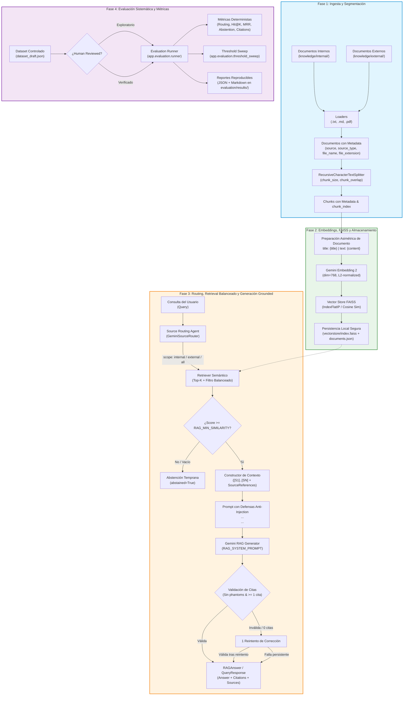

# KnowledgeFlow RAG

Sistema modular basado en LLM, agentes y Retrieval-Augmented Generation (RAG) para la consulta y recuperación trazable de conocimiento organizacional.

---

## Descripción

**KnowledgeFlow RAG** es un proyecto desarrollado para la asignatura **ISY0101 - Ingeniería de Soluciones con IA** (Evaluación Parcial N°1). Su propósito es implementar una arquitectura técnica robusta para el procesamiento, segmentación, indexación vectorial, recuperación semántica y generación aumentada de documentación institucional interna y externa, garantizando trazabilidad, fundamentación estricta en evidencia (*grounding*) y mitigación de alucinaciones.

---

## Problema organizacional

En entornos corporativos, la información crítica (políticas, procedimientos operativos, guías técnicas y normativas externas) se encuentra frecuentemente fragmentada y dispersa en múltiples repositorios y formatos. Los colaboradores invierten tiempo excesivo en localizar respuestas confiables o corren el riesgo de operar con versiones desactualizadas o generar respuestas no fundamentadas.

---

## Objetivo

Proveer un motor RAG asistido por LLM capaz de:
1. Ingerir y segmentar documentación de fuentes internas y externas conservando metadatos de procedencia.
2. Generar representaciones vectoriales densas con `gemini-embedding-2`.
3. Indexar y recuperar evidencia contextual relevante mediante búsqueda semántica con FAISS y similitud coseno.
4. Clasificar la intención y alcance de búsqueda mediante un agente enrutador (`SourceRouter`).
5. Generar respuestas aumentadas, precisas y fundamentadas exclusivamente en la evidencia recuperada, con citas documentales verificables `[S1..SN]`.
6. Abstenerse de responder ante consultas fuera de dominio o con similitud semántica insuficiente.

---

## Alcance actual (Fases 0, 1, 2 y 3)

El estado actual del proyecto cubre la **Fundación Técnica**, la **Ingesta Documental**, el **Motor de Embeddings y FAISS**, y la **Generación Grounded con Agente de Enrutamiento**:

- **Fase 0 — Fundación Técnica**:
  - Estructura modular en Python / FastAPI.
  - Configuración centralizada y tipada mediante Pydantic Settings.
  - Cliente LLM para Google Gemini desacoplado y seguro (sin credenciales expuestas).
  - Endpoint de salud (`GET /health`).
  - Suite de pruebas automatizadas aisladas.

- **Fase 1 — Ingesta Documental y Chunking**:
  - Cargadores para formatos `.txt`, `.md` y `.pdf`.
  - Clasificación e inferencia estricta por jerarquía de ruta (`internal` vs `external`).
  - Extracción estricta de metadatos (`source`, `source_type`, `file_name`, `file_extension`, `page`).
  - Omisión controlada de documentos sin texto extraíble y filtrado de fragmentos vacíos.
  - Estrategia de chunking con `RecursiveCharacterTextSplitter`.
  - Preservación íntegra de metadatos y generación de `chunk_index` para trazabilidad.
  - Validación de coherencia de parámetros (`0 <= CHUNK_OVERLAP < CHUNK_SIZE`).

- **Fase 2 — Embeddings Gemini + FAISS + Recuperación Semántica**:
  - Integración con SDK `google-genai` y modelo `gemini-embedding-2`.
  - Preparación asimétrica de inputs:
    - **Documentos**: `title: {title} | text: {content}` (prioridad: `metadata["title"]` $\to$ `metadata["file_name"]` $\to$ `"none"`).
    - **Consultas**: `task: search result | query: {query}`.
  - Contrato de cardinalidad estricta ($1\text{ chunk} \to 1\text{ vector}$ y $1\text{ query} \to 1\text{ vector}$).
  - Dimensión de embeddings configurable (`EMBEDDING_DIMENSION=768`), validada $>0$.
  - Vector Store local con FAISS (`IndexFlatIP` sobre vectores normalizados L2 para similitud coseno exacta).
  - Resultados tipados (`SearchResult`) con score de similitud, ranking y metadata completa.
  - Filtrado estricto por `source_type` (`internal`, `external` o `None`) garantizando Top-K exacto.
  - Persistencia segura y no ejecutable (sin `pickle`): índice nativo `index.faiss` y manifiesto JSON `documents.json`.
  - Huella digital determinista (`fingerprint` SHA-256) para validación de vigencia del índice.
  - Herramientas CLI: `python -m app.rag.indexer` y `python -m app.rag.search`.

- **Fase 3 — Prompt Engineering + RAG Generation + Source Routing Agent**:
  - **Agente de Enrutamiento de Fuentes (`SourceRouter`)**: clasifica consultas en `internal`, `external` o `all` mediante Gemini estructurado con fallback seguro ante incertidumbre.
  - **Recuperación Balanceada Dual para `all`**: para $k=4$, recupera 2 internas y 2 externas, rellenando cupos si un subconjunto tiene menor evidencia y ordenando finalmente por similitud descendente ($\le K$).
  - **Umbral de Similitud y Abstención Temprana (`RAG_MIN_SIMILARITY=0.60`)**: si la evidencia recuperada no alcanza el umbral mínimo, el pipeline se abstiene tempranamente sin invocar al LLM generador (`abstained=True`).
  - **Prompt Engineering Estructurado (`RAG_SYSTEM_PROMPT`)**: directivas de rol, contexto, anclaje estricto en hechos, citas obligatorias y protección activa contra Prompt Injection (tratando `<context>` y `<question>` como datos no confiables pasivos).
  - **Validación de Citas y Reparación**: cuando existen fuentes recuperadas en el contexto, la respuesta generada debe contener al menos una cita válida `[S#]` y ninguna cita fantasma (e.g. `[S7]` si solo existen `S1..S4`). Ante incumplimiento (0 citas o citas fantasma), el sistema ejecuta como máximo un intento de reparación; si vuelve a fallar, la respuesta se marca como no fundamentada (`is_grounded=False`) y se retorna un fallback controlado. El system prompt instruye al modelo a citar las afirmaciones basadas en la evidencia provista.
  - **Endpoint REST (`POST /api/query`)**: expone el pipeline RAG vía FastAPI con ciclo de vida optimizado (vector store cargado en memoria) y respuesta HTTP 503 controlada si el índice no existe o está desactualizado.
  - **CLI de Consulta Completa (`python -m app.rag.ask`)**: interfaz interactiva para consultar el pipeline RAG y visualizar respuestas, citas y fuentes.
  - **Suite de Pruebas**: 108 pruebas automatizadas 100% offline con proveedores fake deterministas (`FakeSourceRouter`, `FakeRAGGenerator`, `DeterministicFakeEmbeddings`).
- **Fase 4 — Evaluación Sistemática, Dataset Controlado y Métricas Reproducibles**:
  - **Dataset Controlado y Puerta de Revisión Humana**: dataset estructurado con 20 casos controlados (`evaluation/dataset_draft.json` con `human_reviewed=false`). Esquema estricto Pydantic (`EvaluationCase`, `EvaluationDataset`) con puerta humana requerida para corridas oficiales (`--require-reviewed`).
  - **Métricas Deterministas de Routing**: Router Accuracy y Matriz de Confusión $3 \times 3$ excluyendo consultas fuera de dominio (`expected_scope=null`).
  - **Métricas de Recuperación a Nivel de Archivo**: `Hit@K`, `Mean Reciprocal Rank (MRR)`, `Expected Source Recall@K`, cumplimiento de ámbito y cobertura dual balanceada para consultas `all`.
  - **Métricas de Abstención Estandarizadas**: matriz de confusión (TP, FP, TN, FN con abstención como clase positiva), exactitud, precisión y recall.
  - **Métricas de Integridad de Citas y Trazabilidad Contractual**: verificación de citas obligatorias válidas $\ge 1$, resolución estricta contra fuentes recuperadas y cálculo de `Traceable Answer Success Rate`.
  - **Herramienta de Barrido de Umbrales (`threshold_sweep`)**: calibración paramétrica de umbrales `[0.50..0.75]` ejecutando retrieval una sola vez en memoria sin llamadas redundantes al LLM ni mutación de configuración.
  - **Runner de Evaluación y Reportes Reproducibles**: CLI (`python -m app.evaluation.runner`) con trazabilidad completa de Git (commit hash, dirty flag), modelos y huella del vectorstore, generando reportes en JSON y Markdown.

---

## Arquitectura del sistema



---

## Estructura del repositorio

```
Knowledge-RAG/
├── app/
│   ├── __init__.py
│   ├── main.py              # Aplicación FastAPI, health check y registro de rutas API
│   ├── agents/
│   │   ├── __init__.py
│   │   └── source_router.py # Agente clasificador de alcance (internal/external/all)
│   ├── api/
│   │   ├── __init__.py
│   │   └── routes.py        # Endpoint POST /api/query con protección 503 ante stale index
│   ├── core/
│   │   ├── __init__.py
│   │   └── config.py        # Configuración tipada con Pydantic Settings
│   ├── llm/
│   │   ├── __init__.py
│   │   └── client.py        # Cliente desacoplado para Google Gemini
│   ├── evaluation/
│   │   ├── __init__.py      # Exportaciones del framework de evaluación
│   │   ├── schemas.py       # Modelos Pydantic de casos, datasets y reportes
│   │   ├── dataset.py       # Cargador, validador y compuerta de revisión humana
│   │   ├── metrics.py       # Funciones puras de cálculo de métricas de evaluación
│   │   ├── runner.py        # CLI de evaluación end-to-end con trazabilidad Git
│   │   ├── reporter.py      # Generador de reportes en JSON y Markdown
│   │   └── threshold_sweep.py # Herramienta de calibración y barrido de similitud
│   └── rag/
│       ├── __init__.py      # Exportaciones públicas de RAG
│       ├── schemas.py       # Modelos Pydantic (RAGAnswer, RouteDecision, SourceReference, etc.)
│       ├── loaders.py       # Carga de documentos (.txt, .md, .pdf)
│       ├── chunking.py      # Segmentación con RecursiveCharacterTextSplitter
│       ├── embeddings.py    # Preparación asimétrica y cliente Gemini Embedding 2
│       ├── vectorstore.py   # FAISS VectorStore, persistencia JSON y fingerprint SHA-256
│       ├── retriever.py     # Pipeline de búsqueda semántica y filtros
│       ├── context.py       # Formateo de contexto [S1..SN] y validación de citas
│       ├── prompts.py       # RAG_SYSTEM_PROMPT estructurado y defensas contra injection
│       ├── generator.py     # Generador grounded con validación y reparación de citas
│       ├── pipeline.py      # Orquestador end-to-end (Router -> Balanced Retrieval -> Generator)
│       ├── indexer.py       # CLI para carga, chunking, embedding e indexación
│       ├── search.py        # CLI de demostración de recuperación semántica
│       └── ask.py           # CLI interactivo de consulta RAG con respuestas fundamentadas
├── evaluation/
│   ├── dataset_draft.json   # Dataset borrador controlado de 20 casos
│   ├── README.md            # Guía de evaluación y compuerta de revisión humana
│   └── results/             # Directorio de reportes JSON y resúmenes Markdown
│       └── .gitkeep
├── knowledge/
│   ├── internal/            # Políticas, procedimientos y normativas internas (NovaTech SpA)
│   └── external/            # Normativas, guías técnicas y estándares de la industria
├── scripts/
│   ├── test_gemini_embedding.py  # Script manual de verificación de embeddings Gemini
│   ├── test_gemini_chat.py       # Script manual de verificación de chat Gemini
│   └── test_rag_live.py          # Script manual de verificación end-to-end RAG en vivo
├── tests/
│   ├── __init__.py
│   ├── conftest.py          # Fixtures seguras para Windows y pytest
│   ├── test_health.py       # Pruebas del endpoint /health
│   ├── test_loaders.py      # Pruebas de carga e inferencia de metadatos
│   ├── test_chunking.py     # Pruebas de división y trazabilidad
│   ├── test_config_llm.py   # Pruebas de configuración y cliente LLM
│   ├── test_embeddings.py   # Pruebas de preparación y proveedor de embeddings
│   ├── test_vectorstore.py  # Pruebas de FAISS, métricas, filtros y persistencia
│   ├── test_retriever.py    # Pruebas del pipeline de recuperación
│   ├── test_router.py       # Pruebas del agente de enrutamiento y fallbacks
│   ├── test_prompts.py      # Pruebas del system prompt y encapsulamiento XML
│   ├── test_context.py      # Pruebas de construcción de contexto y validación de citas
│   ├── test_security.py     # Pruebas de mitigación de prompt injection
│   ├── test_generator.py    # Pruebas del generador y ciclo de reparación
│   ├── test_pipeline.py     # Pruebas de orquestación, retrieval balanceado y abstención
│   ├── test_api.py          # Pruebas de endpoints FastAPI (POST /api/query)
│   ├── test_evaluation_dataset.py  # Pruebas de esquemas y validación de datasets
│   ├── test_evaluation_metrics.py  # Pruebas de cálculo matemático de métricas
│   ├── test_evaluation_runner.py   # Pruebas de ejecución del runner de evaluación
│   └── test_threshold_sweep.py     # Pruebas de barrido y calibración de umbrales
├── .env.example             # Plantilla de variables de entorno
├── .gitignore               # Exclusiones de Git (entornos, vectorstore, caches, .env)
├── pytest.ini               # Configuración de pruebas automatizadas
├── requirements.txt         # Dependencias del proyecto
└── README.md                # Documentación del proyecto
```

---

## Requisitos

- **Python**: 3.11+ (probado en Python 3.14)
- **Sistema Operativo**: Windows, Linux o macOS

---

## Instalación

1. Clonar el repositorio y ubicarse en el directorio raíz:
```bash
git clone https://github.com/HikariLucy/Knowledge-RAG.git
cd Knowledge-RAG
```

2. Crear y activar el entorno virtual en Windows (PowerShell):
```powershell
python -m venv .venv
.\.venv\Scripts\Activate.ps1
```

3. Instalar las dependencias:
```powershell
pip install -r requirements.txt
```

---

## Configuración

Copiar la plantilla de variables de entorno:

```powershell
Copy-Item .env.example .env
```

Parámetros configurables en `.env`:
- `APP_NAME`: Nombre del servicio (predeterminado: `KnowledgeFlow RAG`).
- `APP_ENV`: Entorno de ejecución (`development`, `production`).
- `GEMINI_API_KEY`: Clave de API de Google Gemini (requerida para llamadas reales al modelo y generación).
- `GEMINI_ROUTER_MODEL`: Modelo liviano para el agente de enrutamiento (predeterminado: `gemini-3.5-flash-lite`; tarea de clasificación estructurada y enrutamiento semántico).
- `GEMINI_CHAT_MODEL`: Modelo generativo LLM para RAG y citas (predeterminado: `gemini-3.5-flash`).
- `GEMINI_EMBEDDING_MODEL`: Modelo de embeddings densos (predeterminado: `gemini-embedding-2`).
- `CHUNK_SIZE`: Tamaño de segmento en caracteres (predeterminado: `500`).
- `CHUNK_OVERLAP`: Solapamiento de segmento en caracteres (predeterminado: `50`).
- `EMBEDDING_DIMENSION`: Dimensionalidad de los vectores densos (predeterminado: `768`).
- `RETRIEVAL_TOP_K`: Número de resultados semánticos a recuperar (predeterminado: `4`).
- `RAG_MIN_SIMILARITY`: Umbral mínimo de similitud coseno para considerar evidencia válida (predeterminado: `0.60`).
- `LLM_TEMPERATURE`: Temperatura de generación para el LLM (predeterminado: `1.0`).
- `VECTORSTORE_DIR`: Directorio local para almacenamiento del índice FAISS (predeterminado: `vectorstore`).

---

## Uso de la Solución

### 1. Indexar la base de conocimiento

Ejecuta el pipeline completo de carga, chunking, generación de embeddings densos con `gemini-embedding-2` e indexación en FAISS:

```powershell
python -m app.rag.indexer
```

### 2. Consultar el Asistente RAG vía CLI (`app.rag.ask`)

Ejecuta consultas en lenguaje natural con enrutamiento automático, recuperación balanceada y respuestas fundamentadas con citas:

```powershell
# Consulta sobre políticas internas (clasifica a internal)
python -m app.rag.ask "¿Cómo reportar un incidente de seguridad?"

# Consulta comparativa (clasifica a all con recuperación balanceada)
python -m app.rag.ask "Compara las políticas internas de contraseñas de NovaTech con los estándares de buenas prácticas"

# Consulta con override manual de alcance y top-k personalizado
python -m app.rag.ask "¿Qué recomendaciones hay sobre manejo de secretos?" -s external -k 3

# Consulta fuera de dominio (gatilla abstención temprana)
python -m app.rag.ask "¿Cuál es la velocidad de la luz en el vacío?"
```

Ejemplo de salida de consulta interna verificada:
```text
========================================
      KnowledgeFlow RAG Assistant
========================================
Query:        ¿Cómo reportar un incidente de seguridad?
Source Scope: internal
Abstained:    False
----------------------------------------
Answer:
Para reportar un incidente de seguridad, se debe notificar inmediatamente cualquier evento inusual, anomalía en registros del sistema o sospecha de compromiso de credenciales. Esto se puede hacer a través del canal de guardia de ciberseguridad, enviando un correo a alerta-seguridad@novatech-demo.local, o registrando un ticket de severidad alta en la mesa de ayuda [S1].

Citations:    S1

Retrieved Evidence Sources:
  [S1] File: procedimiento_incidentes.md | Type: internal | Score: 0.7817 | Chunk: 1
  [S2] File: procedimiento_incidentes.md | Type: internal | Score: 0.7167 | Chunk: 0
  [S3] File: procedimiento_incidentes.md | Type: internal | Score: 0.7151 | Chunk: 5
  [S4] File: procedimiento_incidentes.md | Type: internal | Score: 0.7103 | Chunk: 3
========================================
```

### 3. Iniciar la API REST de FastAPI

```powershell
uvicorn app.main:app --reload --port 8000
```

- **Health Check**: `GET http://localhost:8000/health`
- **Consulta RAG**: `POST http://localhost:8000/api/query`
  ```json
  {
    "query": "¿Qué requisitos deben cumplir las contraseñas?",
    "source_scope": "internal",
    "k": 4
  }
  ```
- **Documentación Swagger**: `http://localhost:8000/docs`

### 4. Evaluación Sistemática y Calibración de Umbrales

```powershell
# A. Ejecución exploratoria sobre dataset borrador controlado
python -m app.evaluation.runner --dataset evaluation/dataset_draft.json

# B. Ejecución oficial estricta (requiere dataset revisado humanamente y working tree limpio)
python -m app.evaluation.runner --dataset evaluation/dataset_verified.json --require-reviewed --require-clean

# C. Barrido de umbrales de similitud (Threshold Sweep sin llamadas redundantes al LLM)
python -m app.evaluation.threshold_sweep --dataset evaluation/dataset_draft.json
```

---

## Verificación de API Gemini en Vivo

Para validar la conectividad real con Google Gemini API sin exponer credenciales:

```powershell
# 1. Verificar generación de embeddings (gemini-embedding-2)
python scripts/test_gemini_embedding.py

# 2. Verificar generación de chat (gemini-2.5-flash / gemini-3.5-flash)
python scripts/test_gemini_chat.py

# 3. Verificar pipeline RAG end-to-end en vivo
python scripts/test_rag_live.py
```

---

## Ejecutar pruebas automatizadas

Ejecutar la suite completa de 132 pruebas automatizadas 100% offline (sin llamadas de red):

```powershell
python -m pytest -v
```

---

## Fuentes de conocimiento

- **`knowledge/internal/`**: Almacena documentación propietaria de la organización ficticia NovaTech SpA (políticas de seguridad, procedimientos de respuesta a incidentes, gestión de accesos y manuales operativos).
- **`knowledge/external/`**: Almacena estándares técnicos de la industria, guías de buenas prácticas y marcos normativos de ciberseguridad (OWASP LLM Prompt Injection Prevention Cheat Sheet, NIST SP 800-218 SSDF, NIST Privacy Framework, etc.).

---

## Datos demo

> **Aviso Académico**: La organización **NovaTech SpA** y los documentos contenidos en `knowledge/internal/` y `knowledge/external/` son enteramente ficticios y han sido diseñados de forma sintética exclusivamente con propósitos pedagógicos para la asignatura **ISY0101**. No corresponden a personas, empresas o infraestructuras reales.
