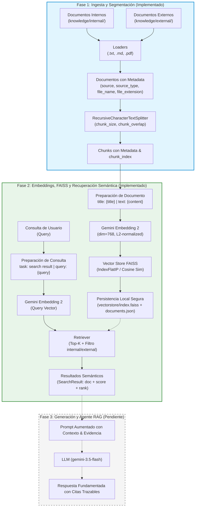

# KnowledgeFlow RAG

Sistema modular basado en LLM, agentes y Retrieval-Augmented Generation (RAG) para la consulta y recuperación trazable de conocimiento organizacional.

---

## Descripción

**KnowledgeFlow RAG** es un proyecto desarrollado para la asignatura **ISY0101 - Ingeniería de Soluciones con IA** (Evaluación Parcial N°1). Su propósito es implementar una arquitectura técnica robusta para el procesamiento, segmentación, indexación vectorial y recuperación semántica de documentación institucional interna y externa, garantizando trazabilidad y mitigando alucinaciones.

---

## Problema organizacional

En entornos corporativos, la información crítica (políticas, procedimientos operativos, guías técnicas y normativas externas) se encuentra frecuentemente fragmentada y dispersa en múltiples repositorios y formatos. Los colaboradores invierten tiempo excesivo en localizar respuestas confiables o corren el riesgo de operar con versiones desactualizadas.

---

## Objetivo

Proveer un motor RAG asistido por LLM capaz de:
1. Ingerir y segmentar documentación de fuentes internas y externas conservando metadatos de procedencia.
2. Generar representaciones vectoriales densas con `gemini-embedding-2`.
3. Indexar y recuperar evidencia contextual relevante mediante búsqueda semántica con FAISS y similitud coseno.
4. Generar respuestas aumentadas, precisas y fundamentadas en fuentes verificables (Fase 3 pendiente).

---

## Alcance actual (Fases 0, 1 y 2)

El estado actual del proyecto cubre la **Fundación Técnica**, la **Ingesta Documental** y el **Motor de Embeddings y Recuperación Semántica con FAISS**:

- **Fase 0 — Fundación Técnica**:
  - Estructura modular en Python / FastAPI.
  - Configuración centralizada y tipada mediante Pydantic Settings.
  - Cliente LLM para Google Gemini desacoplado y seguro (sin credenciales expuestas).
  - Endpoint de salud (`GET /health`).
  - Suite de pruebas automatizadas aisladas.

- **Fase 1 — Ingesta Documental y Chunking**:
  - Cargadores para formatos `.txt`, `.md` y `.pdf`.
  - Clasificación e inferencia estricta por jerarquía de ruta (`internal` vs `external`).
  - Extracción estricta de metadatos (`source`, `source_type`, `file_name`, `file_extension`, `page`).
  - Omisión controlada de documentos sin texto extraíble y filtrado de fragmentos vacíos o compuestos únicamente por espacios en blanco.
  - Estrategia de chunking con `RecursiveCharacterTextSplitter`.
  - Preservación íntegra de metadatos y generación de `chunk_index` para trazabilidad.
  - Validación de coherencia de parámetros (`0 <= CHUNK_OVERLAP < CHUNK_SIZE`).

- **Fase 2 — Embeddings Gemini + FAISS + Recuperación Semántica**:
  - Integración con SDK `google-genai` y modelo `gemini-embedding-2`.
  - Preparación asimétrica de inputs de acuerdo con directrices oficiales:
    - **Documentos**: `title: {title} | text: {content}` (prioridad: `metadata["title"]` $\to$ `metadata["file_name"]` $\to$ `"none"`).
    - **Consultas**: `task: search result | query: {query}`.
    - Preservación íntegra de `page_content` y `metadata` originales sin contaminación.
  - Contrato de cardinalidad estricta ($1\text{ chunk} \to 1\text{ vector}$ y $1\text{ query} \to 1\text{ vector}$).
  - Dimensión de embeddings configurable (`EMBEDDING_DIMENSION=768`), validada $>0$.
  - Vector Store local con FAISS (`IndexFlatIP` sobre vectores normalizados L2 para similitud coseno exacta).
  - Resultados tipados (`SearchResult`) con score de similitud ($[-1.0, 1.0]$, donde mayor puntaje indica mayor similitud), ranking y metadata completa.
  - Filtrado estricto por `source_type` (`internal`, `external` o `None`) garantizando Top-K exacto dentro del subconjunto.
  - Persistencia segura y no ejecutable (sin `pickle`): índice nativo `index.faiss` y manifiesto JSON `documents.json`.
  - Huella digital determinista (`fingerprint` SHA-256) para validación de vigencia del índice frente a cambios en el corpus o parámetros.
  - Herramientas de línea de comandos para indexación (`python -m app.rag.indexer`) y búsqueda interactiva (`python -m app.rag.search`).
  - Suite de 62 pruebas unitarias 100% offline con proveedor determinista desacoplado (`DeterministicFakeEmbeddings`).
  - Script aislado de verificación en vivo con Gemini API (`scripts/test_gemini_embedding.py`).

---

## Arquitectura del sistema



---

## Estructura del repositorio

```
Knowledge-RAG/
├── app/
│   ├── __init__.py
│   ├── main.py              # Aplicación FastAPI y endpoint /health
│   ├── core/
│   │   ├── __init__.py
│   │   └── config.py        # Configuración tipada con Pydantic Settings
│   ├── llm/
│   │   ├── __init__.py
│   │   └── client.py        # Cliente desacoplado para Google Gemini
│   └── rag/
│       ├── __init__.py      # Exportaciones públicas de RAG
│       ├── schemas.py       # Modelos de metadatos, SearchResult y IndexManifest
│       ├── loaders.py       # Carga de documentos (.txt, .md, .pdf)
│       ├── chunking.py      # Segmentación con RecursiveCharacterTextSplitter
│       ├── embeddings.py    # Preparación asimétrica y cliente Gemini Embedding 2
│       ├── vectorstore.py   # FAISS VectorStore, persistencia JSON y fingerprint
│       ├── retriever.py     # Pipeline de búsqueda semántica y filtros
│       ├── indexer.py       # CLI para carga, chunking, embedding e indexación
│       └── search.py        # CLI de demostración de recuperación semántica
├── knowledge/
│   ├── internal/            # Políticas, procedimientos y FAQs internas
│   └── external/            # Normativas, estándares y guías externas
├── scripts/
│   └── test_gemini_embedding.py  # Script manual de verificación de API Gemini
├── tests/
│   ├── __init__.py
│   ├── test_health.py       # Pruebas del endpoint /health
│   ├── test_loaders.py      # Pruebas de carga e inferencia de metadatos
│   ├── test_chunking.py     # Pruebas de división y preservación de trazabilidad
│   ├── test_config_llm.py   # Pruebas de configuración y cliente LLM
│   ├── test_embeddings.py   # Pruebas de preparación y proveedor de embeddings
│   ├── test_vectorstore.py  # Pruebas de FAISS, métricas, filtros y persistencia
│   └── test_retriever.py   # Pruebas del pipeline de recuperación y validaciones
├── .env.example             # Plantilla de variables de entorno
├── .gitignore               # Exclusiones de Git (entornos, vectorstore, caches)
├── pytest.ini               # Configuración de pruebas automatizadas
├── requirements.txt         # Dependencias del proyecto
└── README.md                # Documentación del proyecto
```

---

## Requisitos

- **Python**: 3.11+ (probado en Python 3.14)
- **Sistema Operativo**: Windows, Linux o macOS

---

## Instalación

1. Clonar el repositorio y ubicarse en el directorio raíz:
```bash
git clone https://github.com/HikariLucy/Knowledge-RAG.git
cd Knowledge-RAG
```

2. Crear y activar el entorno virtual en Windows (PowerShell):
```powershell
python -m venv .venv
.\.venv\Scripts\Activate.ps1
```

3. Instalar las dependencias:
```powershell
pip install -r requirements.txt
```

---

## Configuración

Copiar la plantilla de variables de entorno:

```powershell
Copy-Item .env.example .env
```

Parámetros configurables en `.env`:
- `APP_NAME`: Nombre del servicio (predeterminado: `KnowledgeFlow RAG`).
- `APP_ENV`: Entorno de ejecución (`development`, `production`).
- `GEMINI_API_KEY`: Clave de API de Google Gemini (requerida para indexación en vivo y llamadas reales al modelo).
- `GEMINI_CHAT_MODEL`: Modelo generativo (predeterminado: `gemini-3.5-flash`).
- `GEMINI_EMBEDDING_MODEL`: Modelo de embeddings (predeterminado: `gemini-embedding-2`).
- `CHUNK_SIZE`: Tamaño de segmento en caracteres (predeterminado: `500`).
- `CHUNK_OVERLAP`: Solapamiento de segmento en caracteres (predeterminado: `50`).
- `EMBEDDING_DIMENSION`: Dimensionalidad de los vectores densos (predeterminado: `768`).
- `RETRIEVAL_TOP_K`: Número de resultados semánticos a recuperar por defecto (predeterminado: `4`).
- `VECTORSTORE_DIR`: Directorio local para almacenamiento del índice FAISS (predeterminado: `vectorstore`).

---

## Uso de CLI: Indexación y Búsqueda Semántica

### 1. Indexar la base de conocimiento

Ejecuta el pipeline completo de carga, chunking, generación de embeddings e indexación en FAISS:

```powershell
python -m app.rag.indexer
```

Salida esperada:
```text
========================================
      KnowledgeFlow RAG Indexer
========================================
Loading documents from: 'knowledge'...
Documents loaded: 7
Splitting documents (chunk_size=500, chunk_overlap=50)...
Chunks generated: 18
Generating embeddings via model 'gemini-embedding-2' (dim=768)...
Embeddings generated: 18
Building FAISS index (Inner Product / Cosine Similarity)...
Index saved to: '...\vectorstore'
----------------------------------------
Total Chunks:       18
Internal Chunks:    9
External Chunks:    9
Embedding Dim:      768
Index Fingerprint:  a3f89e2c...
========================================
Indexing completed successfully.
```

### 2. Ejecutar búsqueda semántica (Demostración)

Consulta el índice persistido sin requerir servidor web:

```powershell
# Búsqueda global (todas las fuentes)
python -m app.rag.search "¿Qué debo hacer ante un incidente de seguridad?"

# Búsqueda filtrando únicamente fuentes internas y solicitando 2 resultados
python -m app.rag.search "autenticación multifactor" --top-k 2 --source-type internal

# Búsqueda filtrando únicamente normativas y guías externas
python -m app.rag.search "vulnerabilidades OWASP" --top-k 3 --source-type external
```

Salida esperada:
```text
========================================
      KnowledgeFlow RAG Search Demo
========================================
Query:       ¿Qué debo hacer ante un incidente de seguridad?
Top-K:       4
Filter:      None (All Sources)
Results:     4 found
========================================

[1] Score (Cosine Sim): 0.8542
    Source Type: internal
    Source:      knowledge/internal/protocolo_incidentes.md
    File:        protocolo_incidentes.md
    Chunk Index: 0
    Text Preview:
      # Protocolo de Respuesta ante Incidentes...

[2] Score (Cosine Sim): 0.7819
    Source Type: internal
    Source:      knowledge/internal/politica_seguridad.md
    File:        politica_seguridad.md
    Chunk Index: 1
    Text Preview:
      En caso de sospecha o detección de una brecha de seguridad...
```

---

## Verificación de API Gemini en Vivo

Para validar la conectividad real con Google Gemini API y la generación de embeddings en dimensión 768:

```powershell
python scripts/test_gemini_embedding.py
```

- Si `GEMINI_API_KEY` está configurada, generará un embedding de prueba, comprobará la dimensión y reportará éxito sin exponer claves ni vectores.
- Si no está configurada, mostrará una advertencia informativa y saldrá limpiamente.

---

## Ejecutar pruebas automatizadas

Ejecutar la suite completa de pruebas unitarias offline (62 tests):

```powershell
python -m pytest -v
```

Las pruebas cubren:
- Salud del servicio FastAPI (`tests/test_health.py`).
- Ingesta documental y jerarquía de rutas (`tests/test_loaders.py`).
- Segmentación recursiva y trazabilidad (`tests/test_chunking.py`).
- Configuración y cliente desacoplado (`tests/test_config_llm.py`).
- Formateo asimétrico y proveedor de embeddings (`tests/test_embeddings.py`).
- Almacenamiento FAISS, métricas, filtros exactos y fingerprint (`tests/test_vectorstore.py`).
- Pipeline de recuperación semántica (`tests/test_retriever.py`).

---

## Fuentes de conocimiento

- **`knowledge/internal/`**: Almacena documentación propietaria interna de la organización (políticas de seguridad, procedimientos de respuesta a incidentes, manuales operativos y FAQs).
- **`knowledge/external/`**: Almacena fuentes públicas, estándares técnicos de la industria, guías de buenas prácticas y marcos normativos.

---

## Datos demo

> **Aviso Académico**: La organización **NovaTech SpA** y los documentos contenidos en `knowledge/internal/` y `knowledge/external/` son enteramente ficticios y han sido diseñados de forma sintética exclusivamente con propósitos pedagógicos para la asignatura **ISY0101**. No corresponden a personas, empresas o infraestructuras reales.

---

## Estado del proyecto y próximos pasos

- **Completado (Fase 0)**: Fundación técnica, FastAPI, configuración centralizada y cliente Gemini desacoplado.
- **Completado (Fase 1)**: Ingesta de `.txt`, `.md`, `.pdf`, clasificación `internal`/`external`, extracción estricta de metadatos y chunking con trazabilidad.
- **Completado (Fase 2)**: Gemini Embedding 2, preparación asimétrica de inputs, FAISS con similitud coseno, filtros exactos por fuente, persistencia segura en JSON + FAISS binario, huella digital y CLI de indexación/búsqueda.
- **Pendiente (Fase 3)**: Orquestación del agente RAG con LangGraph / LangChain, aumento de contexto, generación de respuestas con `gemini-3.5-flash` y evaluación de métricas de calidad y alucinación.
