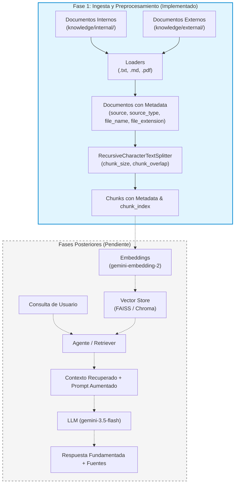

# KnowledgeFlow RAG

Sistema modular basado en LLM, agentes y Retrieval-Augmented Generation (RAG) para la consulta y recuperación trazable de conocimiento organizacional.

---

## Descripción

**KnowledgeFlow RAG** es un proyecto desarrollado para la asignatura **ISY0101 - Ingeniería de Soluciones con IA** (Evaluación Parcial N°1). Su propósito es implementar una arquitectura técnica robusta para el procesamiento, segmentación y consulta fundamentada de documentación institucional interna y externa, garantizando trazabilidad y mitigando alucinaciones.

---

## Problema organizacional

En entornos corporativos, la información crítica (políticas, procedimientos operativos, guías técnicas y normativas externas) se encuentra frecuentemente fragmentada y dispersa en múltiples repositorios y formatos. Los colaboradores invierten tiempo excesivo en localizar respuestas confiables o corren el riesgo de operar con versiones desactualizadas.

---

## Objetivo

Proveer un motor RAG asistido por LLM capaz de:
1. Ingerir y segmentar documentación de fuentes internas y externas conservando metadatos de procedencia.
2. Recuperar evidencia contextual relevante mediante búsqueda semántica.
3. Generar respuestas aumentadas, precisas y fundamentadas en fuentes verificables.

---

## Alcance actual (Fase 0 + Fase 1)

El estado actual del proyecto cubre exclusivamente la **Fundación Técnica** y la **Ingesta Documental**:

- **Fase 0 — Fundación Técnica**:
  - Estructura modular en Python / FastAPI.
  - Configuración centralizada y tipada mediante Pydantic Settings.
  - Cliente LLM para Google Gemini desacoplado y seguro (sin llaves hardcodeadas).
  - Endpoint de salud (`GET /health`).
  - Suite de pruebas automatizadas aisladas.

- **Fase 1 — Ingesta Documental y Chunking**:
  - Cargadores para formatos `.txt`, `.md` y `.pdf`.
  - Clasificación explícita e inferencia estricta por jerarquía de ruta (`internal` vs `external`).
  - Extracción estricta de metadatos (`source`, `source_type`, `file_name`, `file_extension`, `page`).
  - Omisión controlada de documentos sin texto extraíble y filtrado de fragmentos vacíos o compuestos únicamente por espacios en blanco.
  - Estrategia de chunking con `RecursiveCharacterTextSplitter`.
  - Preservación íntegra de metadatos y generación de `chunk_index` para trazabilidad.
  - Validación de coherencia de parámetros (`0 <= CHUNK_OVERLAP < CHUNK_SIZE`).

---

## Arquitectura inicial



---

## Estructura del repositorio

```
Knowledge-RAG/
├── app/
│   ├── __init__.py
│   ├── main.py              # Aplicación FastAPI y endpoint /health
│   ├── core/
│   │   ├── __init__.py
│   │   └── config.py        # Configuración tipada con Pydantic Settings
│   ├── llm/
│   │   ├── __init__.py
│   │   └── client.py        # Cliente desacoplado para Google Gemini
│   └── rag/
│       ├── __init__.py
│       ├── schemas.py       # Modelos Pydantic de metadatos y schemas
│       ├── loaders.py       # Carga de documentos (.txt, .md, .pdf)
│       └── chunking.py      # Segmentación con RecursiveCharacterTextSplitter
├── knowledge/
│   ├── internal/            # Políticas, procedimientos y FAQs internas
│   └── external/            # Normativas, estándares y guías externas
├── tests/
│   ├── __init__.py
│   ├── test_health.py       # Pruebas del endpoint /health
│   ├── test_loaders.py      # Pruebas de carga e inferencia de metadatos
│   ├── test_chunking.py     # Pruebas de división y preservación de trazabilidad
│   └── test_config_llm.py   # Pruebas de configuración y cliente LLM
├── .env.example             # Plantilla de variables de entorno
├── .gitignore               # Exclusiones de Git (entornos, secretos, caches)
├── requirements.txt         # Dependencias del proyecto
└── README.md                # Documentación del proyecto
```

---

## Requisitos

- **Python**: 3.11+
- **Sistema Operativo**: Windows, Linux o macOS

---

## Instalación

1. Clonar el repositorio y ubicarse en el directorio raíz:
```bash
git clone https://github.com/HikariLucy/Knowledge-RAG.git
cd Knowledge-RAG
```

2. Crear y activar el entorno virtual en Windows (PowerShell):
```powershell
python -m venv .venv
.\.venv\Scripts\Activate.ps1
```

3. Instalar las dependencias:
```powershell
pip install -r requirements.txt
```

---

## Configuración

Copiar la plantilla de variables de entorno:

```powershell
Copy-Item .env.example .env
```

Parámetros configurables en `.env`:
- `APP_NAME`: Nombre del servicio (predeterminado: `KnowledgeFlow RAG`).
- `APP_ENV`: Entorno de ejecución (`development`, `production`).
- `GEMINI_API_KEY`: Clave de API de Google Gemini (opcional en Fase 0/1; no requerida para tests ni arranque inicial).
- `GEMINI_CHAT_MODEL`: Modelo generativo (predeterminado: `gemini-3.5-flash`).
- `GEMINI_EMBEDDING_MODEL`: Modelo de embeddings (predeterminado: `gemini-embedding-2`).
- `CHUNK_SIZE`: Tamaño de segmento en caracteres (predeterminado: `500`).
- `CHUNK_OVERLAP`: Solapamiento de segmento en caracteres (predeterminado: `50`).

---

## Ejecutar aplicación

Iniciar el servidor de desarrollo FastAPI con Uvicorn:

```powershell
uvicorn app.main:app --reload
```

Acceso al servicio:
- **Health Check**: `http://127.0.0.1:8000/health`
- **Documentación Interactiva (Swagger UI)**: `http://127.0.0.1:8000/docs`

---

## Ejecutar pruebas

Ejecutar la suite completa de pruebas automatizadas:

```powershell
python -m pytest -v
```

Las pruebas validan la API de salud, carga de documentos, inferencia de tipos de fuentes, segmentación, manejo de errores y validación de parámetros de forma aislada y sin llamadas de red externas.

---

## Fuentes de conocimiento

- **`knowledge/internal/`**: Almacena documentación propietaria interna de la organización (políticas de seguridad, procedimientos de respuesta a incidentes, manuales operativos y FAQs).
- **`knowledge/external/`**: Almacena fuentes públicas, estándares técnicos de la industria, guías de buenas prácticas y marcos normativos.

---

## Datos demo

> **Aviso Académico**: La organización **NovaTech SpA** y los documentos contenidos en `knowledge/internal/` y `knowledge/external/` son enteramente ficticios y han sido diseñados de forma sintética exclusivamente con propósitos pedagógicos para la asignatura **ISY0101**. No corresponden a personas, empresas o infraestructuras reales.

---

## Estado del proyecto y próximos pasos

- **Completado**: Fundación técnica, arquitectura modular, loaders documentales con metadatos estrictos y pipeline de chunking validado.
- **Pendiente para fases posteriores**: Vector store (FAISS), generación de embeddings con Gemini, orquestación del agente RAG y evaluación de métricas de recuperación.
