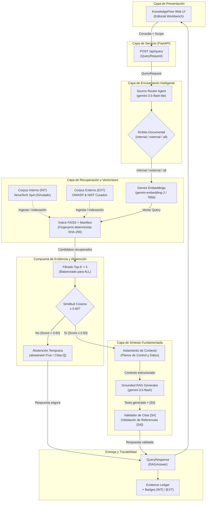

# Arquitectura Técnica del Sistema — KnowledgeFlow RAG

## 1. Visión General de la Solución

KnowledgeFlow RAG es un sistema RAG (*Retrieval-Augmented Generation*) organizacional con enrutamiento inteligente de fuentes, recuperación dual-source balanceada de conocimiento interno/externo, compuerta temprana de abstención por umbral de similitud y validación estricta de citas documentales.

---

## 2. Diagrama de Arquitectura de Precisión

---

## 3. Desglose de Componentes y Modelos

### 3.1. Modelos Asignados
- **Source Router Agent**: `gemini-3.5-flash-lite` (desacoplado para minimizar latencia y consumo de cuota diaria RPD).
- **Generador Fundamentado (Grounded Generator)**: `gemini-3.5-flash` (ejecución con directivas de seguridad y grounding).
- **Modelo de Embeddings**: `gemini-embedding-2` (dimensión `768`, distancia coseno normalizada).

### 3.2. Parámetros de Recuperación y Calibración
- **`RETRIEVAL_TOP_K`**: `4` fragmentos.
- **`RAG_MIN_SIMILARITY`**: `0.60` (threshold seleccionado para esta versión).
  - *Hecho experimental documentado*: Sobre el dataset controlado de 20 casos, 0.60 fue el menor umbral evaluado que conservó el 100% de los casos respondibles y produjo 0% de fuga en consultas fuera de dominio (OOD leakage). No se postula como un óptimo universal fuera del corpus y dataset evaluados.

### 3.3. Mecanismos Clave de la Arquitectura
1. **Enrutamiento Inteligente con Fallback Seguro**: El agente `GeminiSourceRouter` clasifica la intención en `internal`, `external` o `all`. Ante JSON inválido o baja confianza ($<0.50$), conmuta automáticamente a fallback `all`.
2. **Recuperación Balanceada Dual**: Cuando el ámbito es `all`, el recuperador reserva cuotas equitativas ($k/2 = 2$ internas y $k/2 = 2$ externas) evitando que un dominio sature el contexto.
3. **Compuerta Temprana de Abstención (Early Abstention Gate)**: Si ningún fragmento alcanza el umbral de similitud ($\ge 0.60$), el pipeline se abstiene de forma inmediata (`abstained=True`, `citations=[]`, `sources=[]`), evitando llamadas innecesarias al modelo generativo y reduciendo respuestas sin respaldo documental ante preguntas fuera de dominio.
4. **Aislamiento de Planos de Control y Datos (Mitigación de Prompt Injection)**: Las fuentes recuperadas se introducen en el prompt mediante bloques estructurales etiquetados (`<context><source id="S#">...</source></context>`) y se instruye al modelo a tratarlas exclusivamente como datos pasivos no ejecutables.
5. **Validación de Citas y Reparación Controlada**: El generador debe incluir citas `[S#]`. Si cita identificadores inexistentes en el contexto (citas fantasma) o no incluye citas, el sistema ejecuta una reparación controlada mediante una segunda generación con prompt correctivo seguida de revalidación determinista de las citas. Si persiste la anomalía, conmuta a abstención segura.
6. **Verificación de Frescura de Índice (Index Freshness)**: El vectorstore valida en tiempo de carga un fingerprint determinista SHA-256 del corpus y de la configuración del modelo (`verify_index_freshness`) para asegurar coherencia entre el índice y los documentos físicos. Si el corpus cambia sin reindexar, la API responde HTTP 503 impidiendo respuestas desfasadas.
